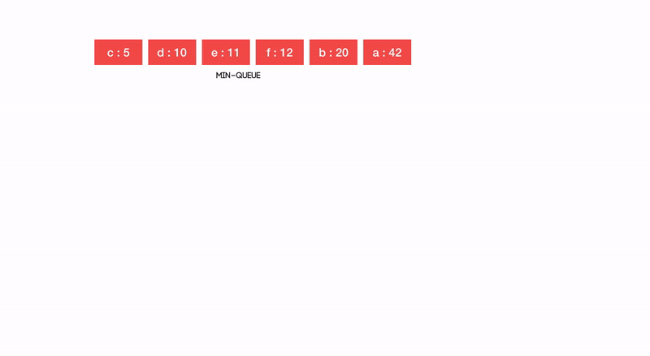

# Compression Algorithms
## Introduction
This lab consist in diferent demos of compression algorithms we are going to exemplifie this ones with some algorithms and toy examples.
## Huffman
Huffman coding is a greedy algorithm used for lossless data compression. The basic principle of Huffman coding is to compress and encode data, assigning variable-length codes to input characters depending on characters frequency on the text. In this way the most frequent character gets the smallest code and the least frequent the largest one. 
The codes assigned are prefixed codes, meaning that they are assigned in such a way that the code assigned to one character is not the prefix of the code assigned to any other character. With this system the code makes sure there is no ambiguity when decoding.

